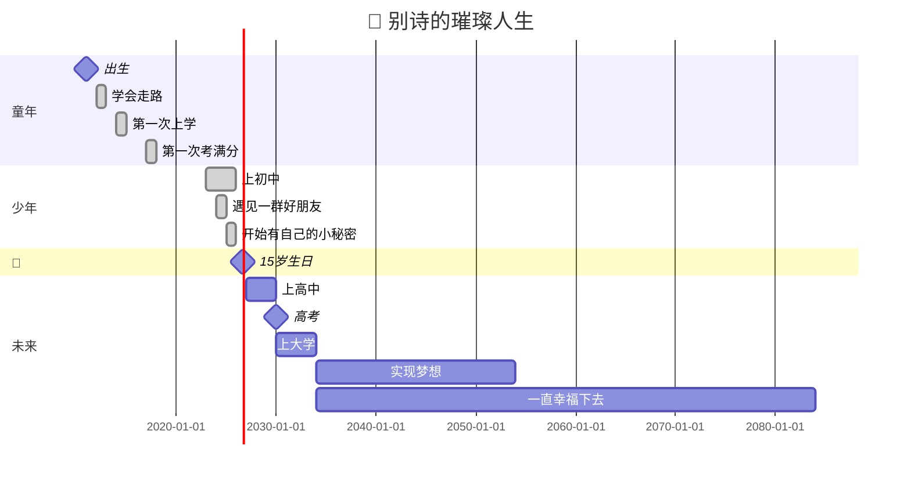

# 🎂 生日快乐，别诗
### — 关于「你」的年龄函数模型

> *"数学是上帝用来书写宇宙的语言。"*  
> — 伽利略·伽利莱

而今天，我们用数学来书写一位朋友的年龄。

---

## 📐 一、定义域与值域

设 `f(t)` 为「别诗的年龄」关于时间 `t` 的连续函数，定义域为：

$$
D_f = [2011, +\infty)
$$

其中 `t = 2011` 为初始条件（即别诗降临人间的年份）。

值域为：

$$
R_f = [0, 15]
$$

> *注：该函数正处于快速增长的「青春期」阶段，斜率为正且波动较大。*

---

## 📈 二、年龄递推公式

采用**一阶线性差分方程**逼近别诗的年龄增长模型：

$$
f(t+1) = f(t) + 1
$$

初始条件：

$$
f(2011) = 0
$$

解得通解：

$$
f(t) = t - 2011
$$

代入 `t = 2026`：

$$
f(2026) = 2026 - 2011 = 15
$$

> 🎉 **喜报**：该值正处于「花季雨季」黄金区间，请尽情享受青春。

---

## 🎯 三、误差分析

考虑到别诗可能觉得自己「已经是个大人了」，引入主观年龄修正项 `ε`：

$$
f_{\text{真实}}(t) = f(t) + \varepsilon
$$

其中 `ε` 满足分段函数：

$$
\varepsilon =
\begin{cases}
+5, & \text{当别诗照镜子觉得自己很成熟时} \\
-3, & \text{当别诗被爸妈管着的时候} \\
0, & \text{当别诗和朋友在一起时（刚刚好）}
\end{cases}
$$

---

## 🧠 四、博弈论视角：15岁的人生选择

把15岁的别诗和「未来」看作博弈双方：

| 策略 \ 对方 | 未来充满机会 | 未来充满挑战 |
|:---:|:---:|:---:|
| **努力学习** | 学霸养成，前途无量 | 实力抗打，不怕困难 |
| **尽情玩耍** | 快乐青春，不留遗憾 | 临时抱佛脚，也能过关 |

**纳什均衡**：别诗的**最优策略**是——**「该学时学，该玩时玩」**。

这就是15岁的魔力：你既有时间做梦，也有时间把梦变成现实。

---

## 🎬 五、如果人生是甘特图

把别诗的人生画成项目进度，15岁是**第一个重要里程碑**：



---

📊 六、15岁的数学之美

别诗今年15岁，这个数字在数学上有很多美妙之处：

15 = 3 \times 5

既是三角形数：

15 = 1 + 2 + 3 + 4 + 5

也是第一个神奇数（magic number）—— 别诗本身就很神奇✨

\boxed{15 = \text{青春最好的年纪}}

---

💬 写在最后

"十五岁，是刚学会做梦，还来得及把梦做完的年纪。"

别诗，15岁的你：

· 还有大把时间探索世界
· 还有无数可能性等你解锁
· 还有漫长的人生路，每一步都算数

祝你15岁生日快乐，愿你永远好奇，永远发光。 🎂

---

📌 本文公式均使用 KaTeX 渲染，流程图使用 Mermaid 语法绘制。

#生日 #数学 #KaTeX #Mermaid #15岁 #别诗 #永远青春

```

---