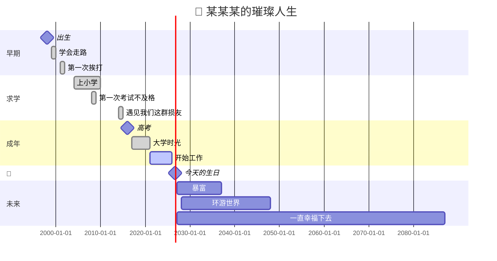

# 🎂 生日快乐  
### — 关于「你」的年龄函数模型

> *"数学是上帝用来书写宇宙的语言。"*  
> — 伽利略·伽利莱

而今天，我们用数学来书写一位朋友的年龄。

---

## 📐 一、定义域与值域

设 `f(t)` 为「你的年龄」关于时间 `t` 的连续函数，定义域为：

$$
D_f = [1998, +\infty)
$$

其中 `t = 1998` 为初始条件（即你降临人间的年份）。

值域为：

$$
R_f = [0, 27]
$$

> *注：理论最大值暂未收敛，正持续观测中。*

---

## 📈 二、年龄递推公式

采用**一阶线性差分方程**逼近你的年龄增长模型：

$$
f(t+1) = f(t) + 1
$$

初始条件：

$$
f(1998) = 0
$$

解得通解：

$$
f(t) = t - 1998
$$

代入 `t = 2026`：

$$
f(2026) = 2026 - 1998 = 28
$$

> ⚠️ **警告**：该值正在逼近「三十而立」警戒线，请尽快完成人生KPI。

---

## 🎯 三、误差分析

考虑到你总说自己「永远18」，引入主观年龄修正项 `ε`：

$$
f_{\text{真实}}(t) = f(t) - \varepsilon
$$

其中 `ε` 满足分段函数：

$$
\varepsilon =
\begin{cases}
10, & \text{当你照镜子时} \\
0, & \text{当你熬夜时} \\
+\infty, & \text{当你被叫叔叔/阿姨时}
\end{cases}
$$

---

## 🧠 四、博弈论视角：年龄的囚徒困境

把你和「时间」看作博弈双方：

| 策略 \ 对方 | 时间公平流逝 | 时间加速流逝 |
|:---:|:---:|:---:|
| **拼命抗衰老** | 赢得面子，输给现实 | 焦虑加倍，得不偿失 |
| **坦然接受** | 心态平和，优雅老去 | 反正都一样，随它去吧 |

**纳什均衡**：几乎所有人类最终都选择了 **「坦然接受 + 该吃吃该喝喝」**。

这就是为什么你明明28了，还能理直气壮地说自己18——**你不是在骗别人，是在和时间和解**。

---

## 🎬 五、如果人生是甘特图

把人生画成项目进度，生日就是**里程碑节点**：

---

📊 六、最终结论

截至本文发布日（2026年8月9日），你的年龄为：

\boxed{f(2026) = 28}

但在我心里：

\boxed{f_{\text{心}}(t) \equiv 18}

---

💬 写在最后

"年龄只是一个数字，除非你是奶酪。但就算是奶酪，你也一定是最美味的那一块。" 🧀

《人民的名义》里赵德汉说「我一分钱都没敢花」，而我想说：
你每一年都没白过。

生日快乐，永远年轻，永远热泪盈眶。🎂

---

📌 本文公式均使用 KaTeX 渲染，流程图使用 Mermaid 语法绘制。

#生日 #数学 #KaTeX #Mermaid #博弈论 #永远18