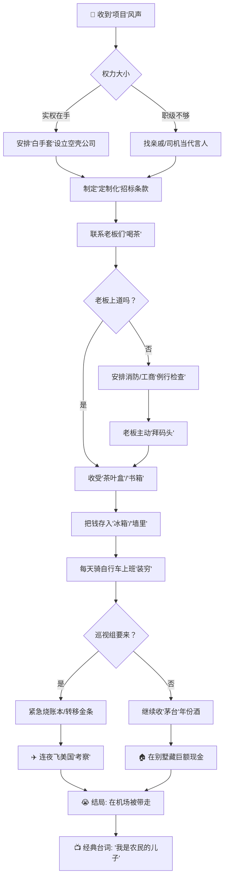

```mermaid
graph TD
    A[🤵 收到'项目'风声] --> B{权力大小}
    B -->|实权在手| C[安排'白手套'设立空壳公司]
    B -->|职级不够| D[找亲戚/司机当代言人]
    
    C --> E[制定'定制化'招标条款]
    D --> E
    
    E --> F[联系老板们'喝茶']
    F --> G{老板上道吗？}
    
    G -->|是| H[收受'茶叶盒'/'书箱']
    G -->|否| I[安排消防/工商'例行检查']
    I --> J[老板主动'拜码头']
    J --> H
    
    H --> K[把钱存入'冰箱'/'墙里']
    K --> L[每天骑自行车上班'装穷']
    L --> M{巡视组要来？}
    
    M -->|是| N[紧急烧账本/转移金条]
    M -->|否| O[继续收'茅台'年份酒]
    N --> P[✈️ 连夜飞美国'考察']
    O --> Q[🏠 在别墅藏巨额现金]
    
    P --> R[😭 结局: 在机场被带走]
    Q --> R
    R --> S[📺 经典台词: '我是农民的儿子']
```