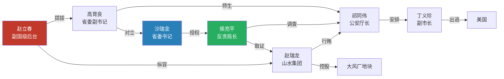
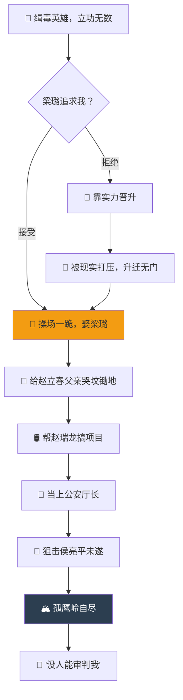
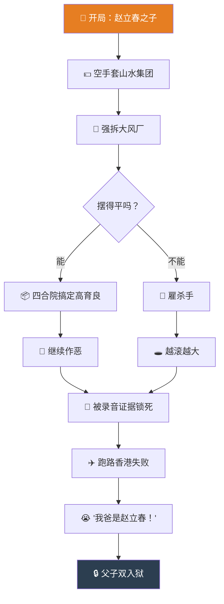
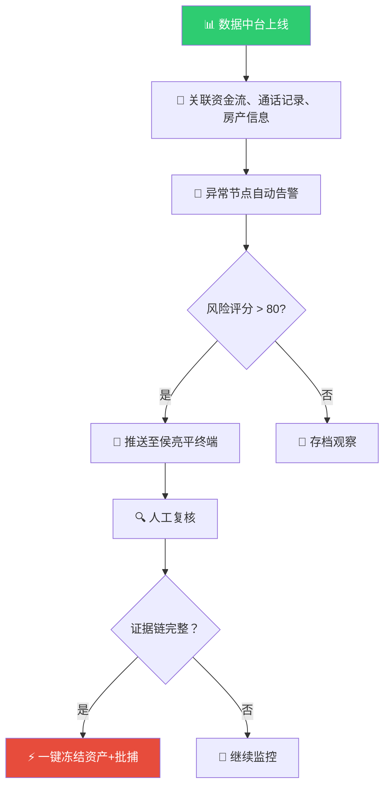

# ⚖️ 汉东省权力游戏  
### — 用数学模型与流程图解构《人民的名义》

> **"我一分钱都没敢花。"**  
> 这句台词背后，藏着一个关于欲望、阶层与规则的精密博弈系统。

如果你只是把《人民的名义》当作"抓贪官"的爽剧，那就太可惜了。  
在这张汉东省的人物关系网之下，运行着一套**近乎完美的权力算法**。

本文将用 **3 张流程图 + 1 个博弈论模型**，让你看清这部剧的真正骨架。

---

## 📊 一、全局视角：汉东省利益输送拓扑图

这是一张把"权力变现"路径可视化的地图。  
每一个箭头，都代表一次资源置换或一次风险对赌。

🔴 红色 = 腐败核心 | 🔵 蓝色 = 改革派 | 🟢 绿色 = 正义执行者

---

🎭 二、人物行为逻辑：三张核心流程图

1. 祁同伟 —— "胜天半子"的赌徒心态

他是全剧最悲情的角色，也是最典型的"寒门逆袭→信仰崩塌"样本。

---

2. 高育良 —— 精致的利己主义算法

他永远在"讲法律"和"保山头"之间做动态平衡。

---

3. 赵瑞龙 —— 权力套利者的死循环

他完美诠释了什么叫 "爹是副国级，所以可以为所欲为→直到不能"。

---

🧠 三、博弈论视角：为什么贪官"停不下来"？

用一个简单的囚徒困境变体来解释：

行为 \ 对方 老实配合 继续贪腐
主动收手 安全，但心理不平衡 被坑，钱没捞着还挨罚
继续贪腐 赚翻，但冒风险 一起下水，抱团取暖

现实结局：几乎所有角色都选择了 "继续贪腐 + 抱团取暖" 这个纳什均衡点，因为"主动收手"在系统里意味着背叛同伙，代价比贪腐更大。

这就是为什么赵德汉把2.3亿藏在别墅里却不敢花——他不是在存钱，是在存"安全感"。

---

🎬 四、如果侯亮平用数据中台查案

最后开个脑洞：假如汉东省引入大数据反腐系统，流程图会变成这样：

结论：再精密的权力算法，也敌不过一套更精密的数据算法。
正义可能会迟到，但日志永远不会删除。

---

💬 写在最后

《人民的名义》之所以封神，不是因为它把贪官拍得多坏，
而是它把人性的算法——贪婪、恐惧、野心、妥协——展现得淋漓尽致。

你可以不追剧，但不能不懂这个社会的运行规则。

---

🔗 相关文章

· Mermaid 流程图完全指南
· 中国官场博弈论的底层逻辑
· 如何用技术思维看社会问题

---

📌 本文所有流程图均使用 Mermaid 语法绘制，欢迎 Fork 二次创作。

#人民的名义 #博弈论 #数据反腐 #Mermaid
