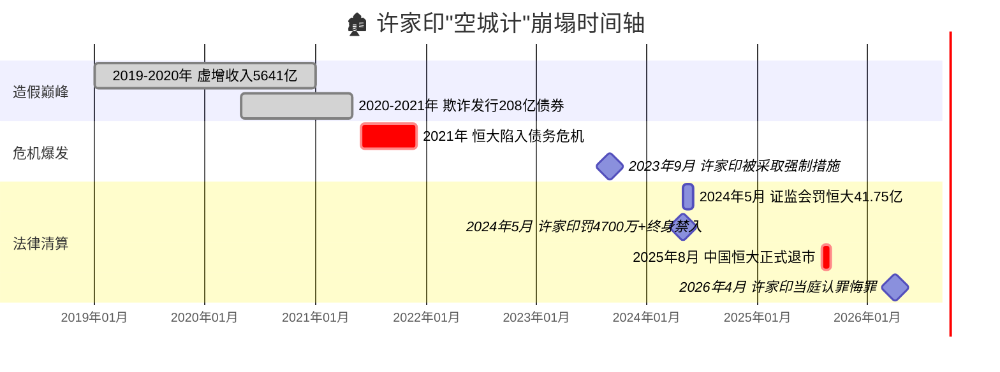

# 🎭 许家印「空城计」

### 一个地产帝国的崩塌全流程

> **"许家印凭一己之力，让大家过上了他小时候的日子。"**

2026年4月，深圳中院被告席上，67岁的许家印安静坐着。检方花了两天宣读八项罪名的起诉书，他没有长篇辩解，最后只说了四个字：**"认罪悔罪。"**

从首富到阶下囚，这出横跨十余年的"空城计"，终于落下帷幕。

---

## 一、"空城"是怎么造出来的

恒大最核心的造假手段，是**提前确认收入**——把还没盖好的楼，在账面上写成"已竣工"。

证监会调查认定：

| 年份 | 虚增收入 | 占营收比例 | 虚增利润 | 公布盈利 | 实际盈利 |
|:---:|:---:|:---:|:---:|:---:|:---:|
| 2019 | **2139亿** | 50.14% | 407亿 | 335亿 | **亏损71亿** |
| 2020 | **3501亿** | 78.54% | 513亿 | 314亿 | **亏损199亿** |

**两年虚增收入5641亿**——相当于凭空变出了一个"中型房企"的全年销售额。

手段有多离谱？审计师去工地现场考察，明明亲眼看到塔吊还在转、楼还没封顶，恒大管理层递过来说"这楼算完工了"，审计师连求证电话都没打，直接在底稿上签了字。甚至，恒大可以替换掉审计师要抽查的楼盘样本，直接替审计师挑选"看上去很美"的项目。

---

## 二、这座"空城"骗了谁

恒大用虚假财报在交易所市场公开发行了**5期合计208亿元债券**，存在欺诈发行。

但更大的受害者，是那些买了恒大理财的普通人：

- **2.44万亿**的总债务窟窿
- **340亿**至今未能兑付的理财产品
- **数百个**烂尾楼盘，遍布全国
- **约16万名**小股东，持股市值几乎归零

> "有的人是养老钱，有的人是买房钱，有的人是给孩子攒的教育金。许家印一句'认罪悔罪'说完了，他们的钱呢？"

---

## 三、时间轴："空城"崩塌的五年



---

四、谁为"空城计"陪葬

```mermaid
graph TD
    A[🎭 许家印"空城计"] --> B[👥 陪葬者]
    
    B --> C[🏠 数百万购房者<br>烂尾楼业主]
    B --> D[🏦 金融机构<br>2.44万亿债务黑洞]
    B --> E[📄 供应商<br>拖欠工程款]
    B --> F[📊 中小股东<br>市值归零]
    B --> G[📋 普华永道<br>被罚没4.41亿+10亿和解]
    
    C --> H[😢 交了钱 拿不到房]
    D --> I[💸 坏账 系统风险]
    E --> J[⚖️ 诉讼 破产]
    F --> K[📉 血本无归]
    G --> L[🚫 禁业6个月]
    
    style A fill:#e74c3c,color:#fff
```

2024年9月，证监会与财政部对恒大审计机构普华永道合计罚没4.41亿元。2026年4月，普华永道（香港）再被罚3亿港元，并预留10亿港元赔偿投资者，同时被禁止承接新上市公司客户6个月。

---

写在最后

这出"空城计"的结局，不是瞒天过海，而是留下一地鸡毛。

当年诸葛亮空城退敌，赌的是司马懿的多疑，赢的是千古美名。如今许家印的空城，骗的是掏空六个钱包的普通人，留下的是无数烂尾楼和还不完的房贷。

2026年4月，许家印在深圳中院当庭认罪，法庭将择期宣判。

---

📌 本文数据来源：中国证监会行政处罚决定书、香港证监会公告、央视新闻、BBC中文网。

#许家印 #恒大 #空城计 #财务造假 #Mermaid #金融反腐